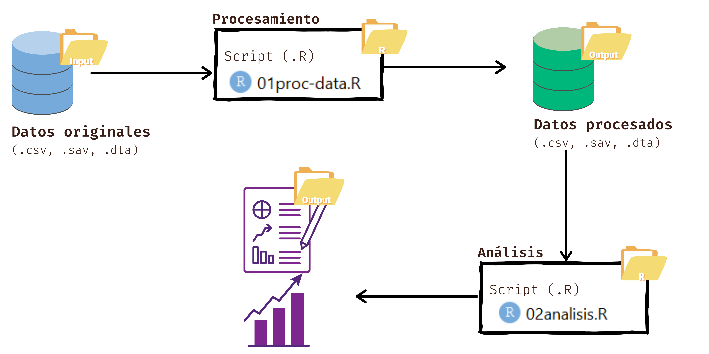

```{r setup, include=FALSE}
knitr::opts_chunk$set(echo = TRUE)
```

## 1. Carga de paquetes

Para este informe utilizaremos el paquete **tidyverse**  y el paquete Paquete **pacman**, una colección de paquetes diseñados para la manipulación, visualización y análisis de datos. Por último el paquete pacman es una recopilación de otros tantos paquetes que se agrupan solamente en uno.

```{r, eval=FALSE}
library(tidyverse)
library (pacman)
```

**¿Para qué se usan estos comandos?**

-El paquete pacman simplifica la carga e instalación de paquetes en R. En lugar de escribir varias líneas de código para verificar si un paquete está instalado y luego cargarlo, pacman lo hace en una sola línea.

**Funciones clave**:

p_load(paquete1, paquete2, ...): Instala (si no está instalado) y carga los paquetes mencionados.

p_unload(paquete): Descarga un paquete de la sesión actual.

p_install(paquete): Instala un paquete sin necesidad de usar install.packages().

p_loaded(): Muestra los paquetes cargados actualmente.

**¿Por qué usar pacman?**
✔️ Ahorra tiempo evitando escribir install.packages() y library().
✔️ Útil cuando trabajas en múltiples proyectos y necesitas cargar paquetes de manera eficiente.


-El tidyverse es un conjunto de paquetes diseñados para trabajar con datos de manera eficiente y coherente.

**Incluye los siguientes paquetes principales**:

ggplot2: Visualización de datos.

dplyr: Manipulación de datos (filtrar, seleccionar, agrupar).

tidyr: Transformación y limpieza de datos.

readr: Lectura de datos en formatos como CSV o TXT.

tibble: Alternativa mejorada a los data frames.

forcats: Manejo de factores.

stringr: Manipulación de cadenas de texto.

purrr: Programación funcional para listas.


**¿Por qué usar tidyverse?**
✔️ Hace el código más legible y eficiente.
✔️ Establece una forma estandarizada de trabajar con datos en R.
✔️ Integra múltiples paquetes en un solo ecosistema.

## 2. Flujo

Aquí se presenta un esquema del flujo de trabajo en R:



- **aporte**: Contiene datos de entrada o documentos de referencia.
- **R**: Guarda los scripts en R que procesan los datos.
- **producción**: Archivos finales generados, como gráficos y tablas.

**¿Para qué sirve un archivo `.Rproj`?**

Un archivo `.Rproj` (R Project) organiza el entorno de trabajo en RStudio, facilitando la gestión de archivos y dependencias dentro del proyecto.

## 3. Descriptivos


Fuente: **Ministerio de Desarrollo Social y Familia. (2017). Porcentaje de personas en situación de pobreza multidimensional, mediciones con cuatro y cinco dimensiones, 2009-2017. En Evolución de la pobreza 1990-2017: ¿Cómo ha cambiado Chile? Observatorio Social, Encuesta Casen 2009-2017.**


**Explicación:**  
El gráfico muestra el porcentaje de personas en situación de pobreza, se mide a través de múltiples dimensiones, con cuatro, 2009-2017, y cinco dimensiones, 2015-2017. Desde la perspectiva critica y sociologica, es relevante ya que antes no se podía trabajar con más dimensiones para así poder abarcar más factores por los cuales se produce la pobreza. Gracias a los nuevos avances sociales, se puede trabajar y realizar investigaciones con más de una dimensión. Con el próposito de aportar nuevas politicas públicas y cosntribuir al bienestar social.


**Bibliografía**:

(Evolución de la pobreza 1990-2017: ¿Cómo ha cambiado Chile?) https://observatorio.ministeriodesarrollosocial.gob.cl/pobreza


